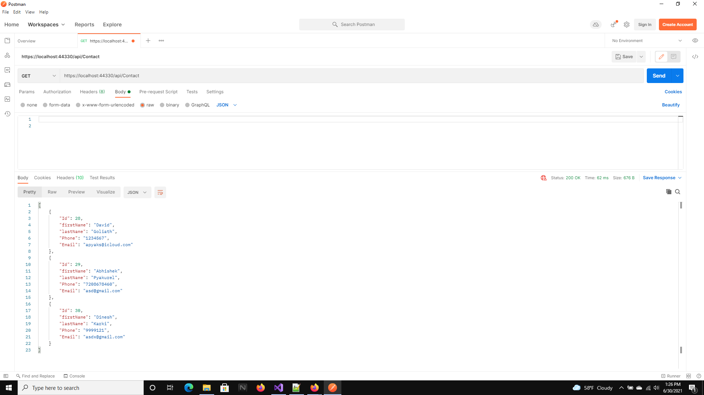
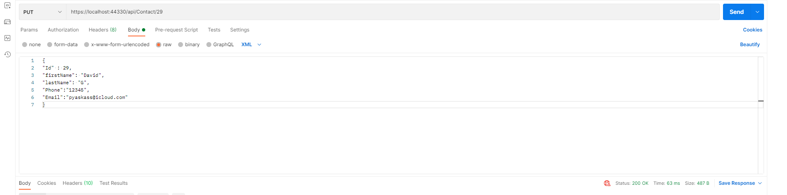
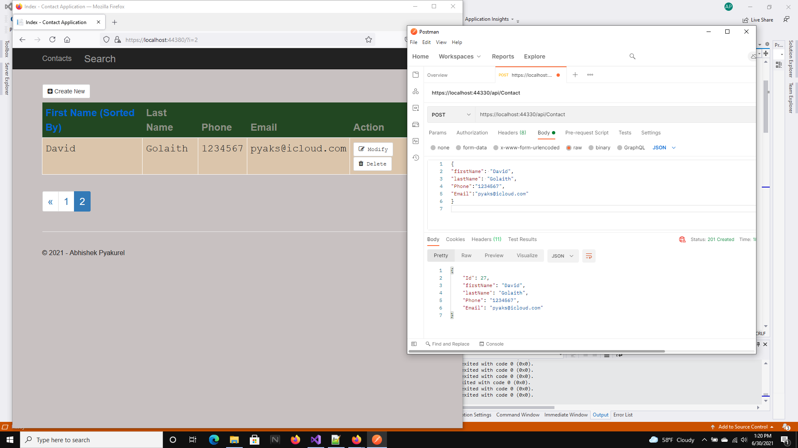
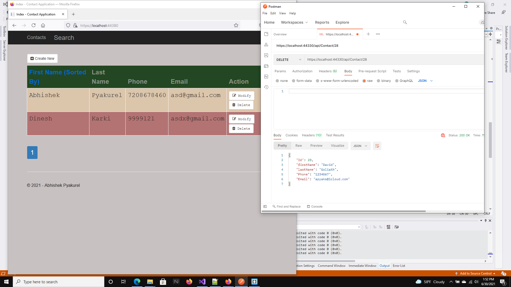

**Name**:  ABHISHEK PYAKUREL

# Web Api with MVC Application: Contact Lists

## Links to the Website:

1. [Link to Homepage](https://pyaks.azurewebsites.net/)
2. [Link to Web Api](https://webapia.azurewebsites.net)

## Tools Used
+ Asp .Net Framework 4.7
+ Web API
+ MVC
+ Rest API
+ Entity Framework
+ Bootstrap
+ Razor Pages
+ Javascript
+ OOP
+ Microsoft SQL Server
+ Azure Cloud
+ Visual Studio
+ PostMan

## UML
1. SQL
| Contacts                |
 
| -----------             |
 
| Id  int                 | 
 
| firstName varchar(50)   | 
 
| lastName varchar(50)    | 
 
| Phone varchar(50)       | 
 
| Phone varchar(50)       | 
 

## Web Api vs MVC
1. Web API vs MVC

## PostMan Testing

### 1. Get

### 1. Get By ID

### 2. Put

### 3. Post

### 4. Delete

